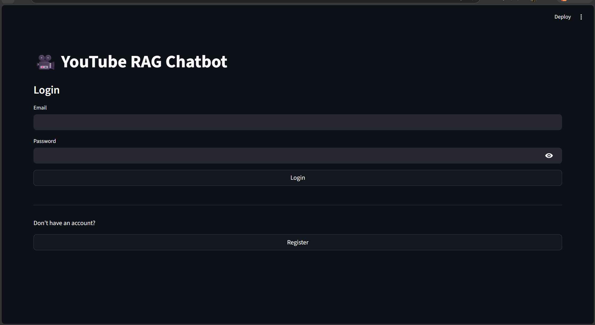
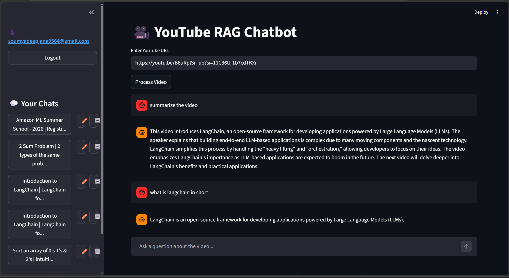

# 🤖 YouTube RAG Chatbot

An AI-powered chatbot that lets you **ask questions about any YouTube video**. Paste a YouTube URL, process the video, and get intelligent answers powered by Google Gemini — with full chat history, user authentication, and Docker deployment support.

[](https://www.python.org/)
[](https://streamlit.io/)
[](https://www.langchain.com/)
[](https://www.docker.com/)
[](LICENSE)

---

## 📸 Screenshots
## Login page

## Chatting page


---

## ✨ Features

- 🔐 **User Authentication** — Register and login with OTP-based email verification
- 💬 **Multiple Chats per User** — Create and manage separate chat sessions
- 📝 **Persistent Chat History** — All conversations are saved to SQLite
- 🎬 **YouTube Transcript Extraction** — Uses YouTube Transcript API with Whisper + yt-dlp as fallback
- 🍪 **Cookie Support** — Handles age-restricted or bot-protected YouTube videos via `cookies.txt`
- 🧠 **RAG Pipeline** — Transcript → Chunking → FAISS Embeddings → Gemini LLM → Answer
- 🐳 **Dockerized** — Ready to deploy on AWS EC2 or any cloud provider

---

## 🛠️ Tech Stack

| Layer | Technology |
|-------|-----------|
| Frontend | Streamlit |
| Backend | Python |
| LLM | Google Gemini 2.5 Flash |
| Framework | LangChain |
| Vector Store | FAISS |
| Embeddings | Google Generative AI Embeddings |
| Database | SQLite |
| Transcript | YouTube Transcript API + Whisper + yt-dlp |
| Deployment | Docker + AWS EC2 |

---

## 📁 Project Structure

```
youtube-rag-chatbot/
├── auth/
│   ├── __init__.py
│   ├── auth.py           # Registration, OTP verification, login logic
│   └── email.py          # Email sending for OTP
├── db/
│   ├── __init__.py
│   └── database.py       # SQLite: users, chats, messages
├── rag/
│   ├── chains.py         # LangChain RAG chain setup
│   ├── prompts.py        # Prompt templates
│   ├── transcript.py     # YouTube transcript extraction pipeline
│   └── vectorstore.py    # FAISS vector store creation & loading
├── screenshots/
│   ├── login.png
│   └── chat.png
├── app.py                # Main Streamlit app entry point
├── Dockerfile
├── requirements.txt
└── .gitignore
```

---

## 🚀 Getting Started

### Prerequisites

- Python 3.10+
- A Google Gemini API key ([Get one here](https://aistudio.google.com/))
- Docker (optional, for containerized deployment)

### 1. Clone the Repository

```bash
git clone https://github.com/Soumyadeep99/youtube-rag-chatbot.git
cd youtube-rag-chatbot
```

### 2. Create a Virtual Environment

```bash
python -m venv venv
source venv/bin/activate        # On Windows: venv\Scripts\activate
```

### 3. Install Dependencies

```bash
pip install -r requirements.txt
```

### 4. Configure Environment Variables

Create a `.env` file in the root directory:

```env
# Google Gemini API
GOOGLE_API_KEY=your_google_gemini_api_key_here

# Email (for OTP authentication)
EMAIL_ADDRESS=your_email@gmail.com
EMAIL_PASSWORD=your_app_password_here
```

> **Note:** For Gmail, use an [App Password](https://support.google.com/accounts/answer/185833) instead of your regular password.

### 5. (Optional) Add YouTube Cookies

If you need to process age-restricted or bot-protected videos, export your browser cookies and place the file at:

```
cookies/cookies.txt
```

You can export cookies using a browser extension like [Get cookies.txt LOCALLY](https://chrome.google.com/webstore/detail/get-cookiestxt-locally/).

### 6. Run the App

```bash
streamlit run app.py
```

The app will be available at `http://localhost:8501`.

---

## 🐳 Docker Deployment

### Build the Image

```bash
docker build -t youtube-rag-chatbot .
```

### Run the Container

```bash
docker run -d \
  -p 8501:8501 \
  --env-file .env \
  -v $(pwd)/vector_db:/app/vector_db \
  -v $(pwd)/cookies:/app/cookies \
  --name rag-chatbot \
  youtube-rag-chatbot
```

> ⚠️ **Important:** Do **not** mount the `/app/db` directory. This will hide `database.py` and break the app. Only mount `vector_db` and `cookies`.

### Access the App

```
http://localhost:8501
```

---

## ☁️ AWS EC2 Deployment

1. Launch an EC2 instance (Ubuntu recommended)
2. Install Docker on the instance
3. Pull your image from Docker Hub or copy it to the instance
4. Run the container with the same command as above, replacing `$(pwd)` with your EC2 directory paths
5. Open port `8501` in your EC2 Security Group inbound rules
6. Access via `http://<your-ec2-public-ip>:8501`

---

## 🔄 How It Works

```
YouTube URL
    │
    ▼
Transcript Extraction
(YouTube API → Whisper → yt-dlp fallback)
    │
    ▼
Text Chunking
    │
    ▼
Google Generative AI Embeddings
    │
    ▼
FAISS Vector Store
    │
    ▼
User Query → Retriever → Relevant Chunks
                               │
                               ▼
                        Gemini 2.5 Flash
                               │
                               ▼
                        Answer + Saved to Chat History
```

---

## 🐛 Known Issues & Debugging

- **yt-dlp format errors on AWS:** Some videos may fail due to YouTube restrictions or format availability. Debug `rag/transcript.py` and yt-dlp options if this occurs.
- **Bot verification on YouTube:** Ensure `cookies/cookies.txt` is up-to-date and correctly mounted.
- **Module not found errors in Docker:** Caused by incorrect bind mounts. Never mount `/app/db` — it masks `database.py`.

---

## 🔮 Roadmap

- [ ] Dedicated third-party transcript providers as fallback
- [ ] Per-chat vector index storage
- [ ] Response caching for repeated queries
- [ ] Improved error handling and user feedback
- [ ] Enhanced UI and chat management features

---

## 🤝 Contributing

Contributions are welcome! Please open an issue or submit a pull request.

---

## 📄 License

This project is licensed under the [MIT License](LICENSE).

---

## 👤 Author

**Soumyadeep** — [GitHub](https://github.com/Soumyadeep99)
